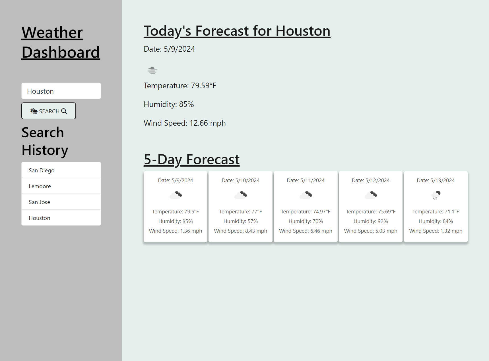

# Weather Dashboard

## Description

This dashboard provides the current weather and 5-day forecast for the city that is entered in the search bar.

## Links
- https://bragonese1.github.io/weather-dashboard/
- https://github.com/bragonese1/weather-dashboard


## Installation
```md
Server-Side-APIs
```

## Usage
After the user enters a city into the search bar, the current weather and the 5-day forecast will display on the page. The searched city will then be added to the search history. The user can click on the city in the search history to display the current weather and 5-day forecast for that city. As the user continues to search for different cities they will continue to be added to the search history. Also, there is a cool hover trick on the 5-day forecast.




## Acknowledgements

```md
- Mariah Wear -TA
- Clarence Cheung -TA
- Mark Carlson -Professor
```